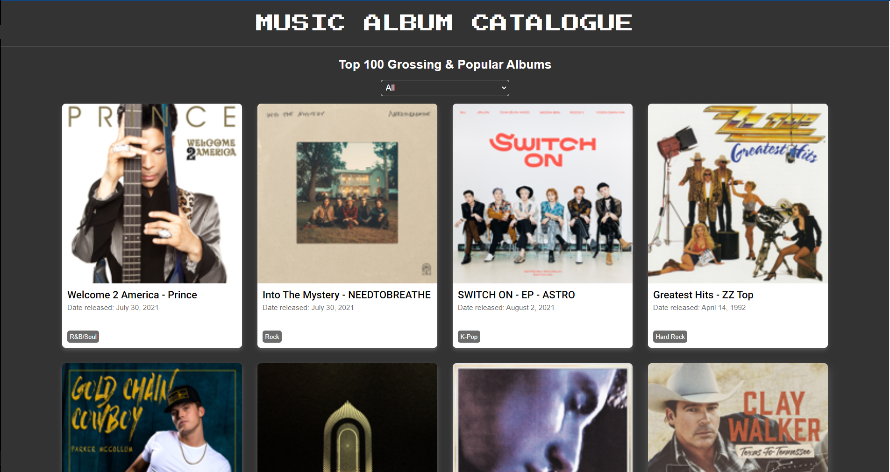
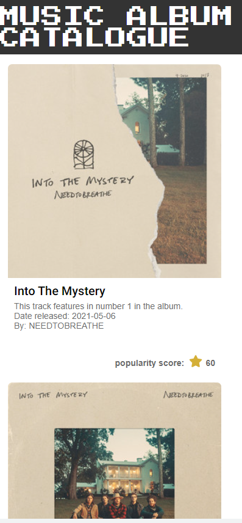

# MUSIC ALBUM CATALOGUE

> Built using JavaScript and React.

## Table of Contents

* [About the Project](#about-the-project)
  * [Built With](#built-with)
* [Setup](#setup)
  * [Get API access keys](#get-api-access-keys)
* [Author](#author)
* [Show your Support](#show-your-support)
* [Acknowledgements](#acknowledgements)

<!-- ABOUT THE PROJECT -->
## About The Project

### Home Page (Landing)

<p align="center">
  
</p>

### Mobile View

<div align="center">

|Mobile View Home Page|Search Page|
|:--:|:--:|
|||

</div>


The project got built based on a catalogue of Top 100 grossing & popular albums in the US. That was the base idea for the project. The original idea was to create a music app using JavaScript and React. And allow creativity to lead the development. For this project, I got asked to create a React app for these top 100 albums. For implementation, chose the route of a Single Page Application (SPA).  I included Redux in the SPA for easier state management. 

It has a home page for browsing through the catalogue items and a details page for one of the catalogue items (basically the tracks in these albums). I elected to use the [Spotify API](https://developer.spotify.com/documentation/web-api/) to search for records to the albums since it was free to use, and with simple authentication, one was good to go.

On the Home page, when a user first visits the app, you can see a list of today's most popular albums. Through there, you can either open one of the listed albums and sift through with genres as well. When you select an album is displays tracks in the album and details about the records.

### Built With

*   React
*   Redux
*   [Spotify API](https://developer.spotify.com/documentation/web-api/)
*   yarn
*   CSS
*   ES6

## Setup

```terminal
git clone http://saltpay-lecefb@git.codesubmit.io/saltpay/salt-eng-javascript-and-react-qvksmb
```

***NOTE: Password will be provided for by the team***

### Install dependencies

```terminal
yarn install
```
<!-- Get API access keys -->
### Get API access keys

1. In the `/src/helpers` directory, create a file called `Credentials.js` Here, you will create a data structure that will be used to query the Spotify API
2. Head over to the `src/.env` file and copy the code there into the newly created file, `src/helpers/Credentials.js`.
3. Now, we need to head over to [Spotify](https://developer.spotify.com/dashboard/login) and get our keys to use here.
4. In the link provided above, you will need to log in to your Spotify account and create a new app.
5. Fill in the details, like app name(could be any name) and description. Agree to the terms and click create.
6. If successful, you will get provided with a list of credentials for your app. Copy them one by one and paste them into the fields in the `src/helpers/Credentials.js` file.
7. Now, we are ready to move to the next section.

### Start Development Server

```terminal
yarn start
```

### Visit this link in your browser

```terminal
http://localhost:3000/
```

### Run ESlint

```terminal
npx eslint .
```

### Run Stylelint

```terminal
npx stylelint "**/*.{css,scss}"
```

### Run Tests

```terminal
yarn test
```

<!-- CONTACT -->
## Author

- Github: [christianotieno](https://github.com/christianotieno)
- Twitter: [@iamchrisotieno](https://twitter.com/iamchrisotieno)
- Linkedin: [Chrisitan Otieno](https://www.linkedin.com/in/christianotieno/)


<!-- ABOUT THE PROJECT-->
## Show your support

Give a star if you like this project!

<!-- ACKNOWLEDGEMENTS -->
## Acknowledgements

* [SaltPay](https://www.microverse.org/)
* [Spotify - API](https://developer.spotify.com/documentation/web-api/)
* [Itunes -RSS Feeds](https://itunes.apple.com/us/rss/topalbums/limit=100/json)